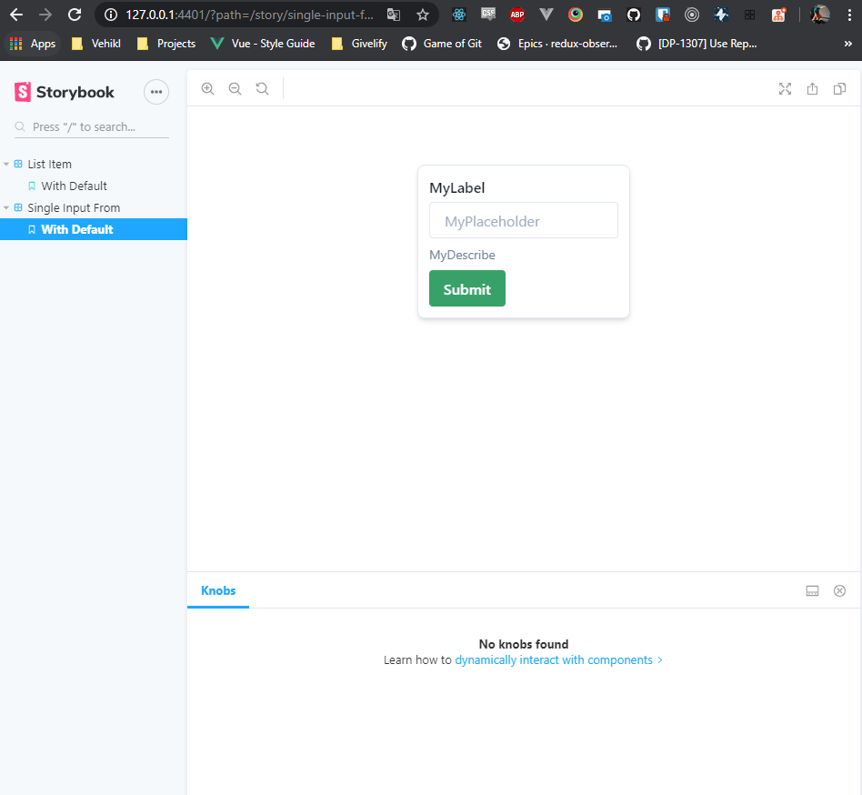

# React Testing

---

## What it is?

This repository was setup to be an exemplary referential project for an Nx React Application. It is built using the best of modern practices and fully embraces the GitHub ecosystem utilizing GitHub Actions as the driving agent for achieving Continuous Integration.

The project is scaffolded as an Nx Monorepo, inside contains the following:

### Applications

#### `web-ui`

The `web-ui` application is the React App.

##### `web-ui-e2e`

The `web-ui-e2e` application is the setup for the UI Testing using Cypress.

#### `api` (todo)

The `api` is a yet-unused-but-fully-setup barebones NestJs application that exposes some authentication GraphQL endpoints. It is intended to use this api as another testable integration point for the React App.

#### `ui-components-e2e` (todo)

The `ui-components-e2e` application is for UI test around the ui component library included in this Nx Monorepo.

### Libraries

#### `ui-components`

The `ui-components` library is to demonstrate setting up a reusable component library for the React application. By extracting the reusable components to a separate library, the `apps/web-ui` can have a narrower focus on business logic instead of presentational setup.

## Local Development

Due to being an NX Monorepo, there is a single `package.json` entrypoint into the project at the root.

1. Ensure that you're using the correct version of Node via nvm by running `nvm use`. Please note you must have `nvm` installed.
2. Run `yarn` to install the required dependencies. You'll have access to the standard Nx scripts as well we a few custom ones.
3. Copy the `.envrc.example` to `.envrc`, you'll need to provide a valid `GITHUB_API_TOKEN` value in order for the integration tests to pass when they attempt to communicate with GitHub.

### Storybook

Storybook has been setup as a visual reference for the component library and can be run using `yarn storybook`. This will serve Storybook for you to refer to.

### Testing

The repository has been built with a TDD philosphy. The unit tests can be run using `yarn test web-ui`, include `--watch` to enable watch mode.

#### Coverage Reports

To receive a coverage report around the tests run `yarn test:web-ui:coverage`. The coverage reports hve been included in the CI pipeline and get commented on the related PR by using the repositories secret GitHub API Token.

#### UI Testing - Cypress

To run the UI tests run `yarn e2e web-ui-e2e`, include `--watch` to enable watch mode with the live UI.

### Continuous Integration

Continuous Integration has been setup using GitHub Actions. You can refer to `.github/workflows/ci.yml` for the configuration.
